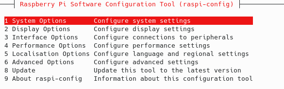
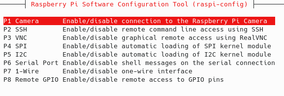
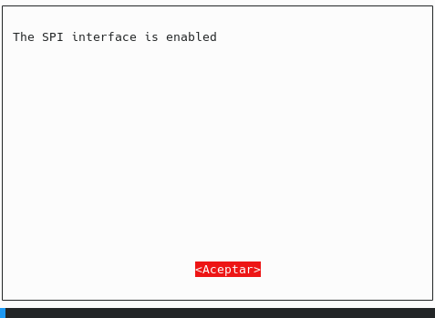
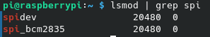
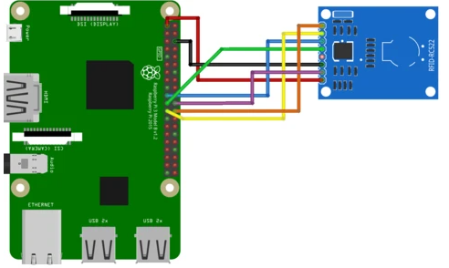

# **RC522-RaspberryPi**
Lector de RC522 a través de RaspberryPi
## **INSTRUCCIONES**
## *HABILITAR SPI*
### PRIMERO TENEMOS QUE HABILITAR LA INTERFAZ SPI DE NUESTRA RASPBERRY PI
`sudo raspi-config`
### NOS DIRIGIMOS A OPCIONES DE INTERFAZ

### DENTRO DE AHÍ DEBEMOS SELECCIONAR SPI Y HABILITARLAS.

### UNA VEZ HABILITADAS TENDREMOS QUE REINICIAR NUESTRA RASPBERRY PI
`sudo reboot now`
### PARA COMPROBAR QUE NUESTRA RASPBERRY PI TIENE LA INTERFAZ SPI HABILITADA INGRESAREMOS EL SIGUIENTE COMANDO
`lsmod | grep spi`
### DEBERIAMOS VER ALGO COMO ESTO:

## *INSTALAR DEPENDENCIAS*
### ANTES DE INSTALAR CUALQUIER COSA DEBEMOS ASEGURARNOS QUE NUESTRA RASPBERRY PI ESTA ACTUALIZADA Y TIENE LOS PAQUETES MÁS NUEVOS.
`sudo apt-get update`
`sudo apt-get upgrade`
### AHORA INSTALAREMOS UN GESTOR DE VERSIONES(EN CASO DE QUE NO LO TENGAS) GIT, UN ADMINISTRADOR DE PAQUETES DE PYTHON(PIP3) Y UN PAQUETE DE DESARROLLO PARA PYTHON
`sudo apt-get install python3-dev python3-pip git`
### EL SIGUIENTE PASO ES INSTALAR UNA LIBRERIA QUE AYUDA CON EL MANEJO SPI Y QUE ADEMAS ES UNA DEPENDENCIA DE LA LIBRERIA QUE INSTALAREMOS A CONTINUACIÓN.
`sudo pip3 install spidev`
### AHORA MEDIANTE EL GESTOR DE PAQUETES PIP3 INSTALAREMOS LA BIBLIOTECA NECESARIA PARA EL USO DEL RC522
`sudo pip3 install mfrc522`
## *DIAGRAMA ESQUEMATICO*

### RC522----->RPi3 Model B+
- SDA --> Pin24/GPIO8(CE0)
- SCK --> Pin23/GPIO11(SCKL)
- MOSI --> Pin19/GPIO10(MOSI)
- MISO --> Pin21/GPIO9(MISO)
- IRQ --> NO SE CONECTA
- GND --> CUALQUIER GND(Pin6/GND en este caso)
- RST --> Pin22/GPIO25
- 3.3v --> Pin1/3v3
## **RECUERDA CORRER CADA PROGRAMA CON PERMISOS DE SUPERUSUARIO DADO QUE EL ACCESO SPI NECESITA DE ELLOS**

